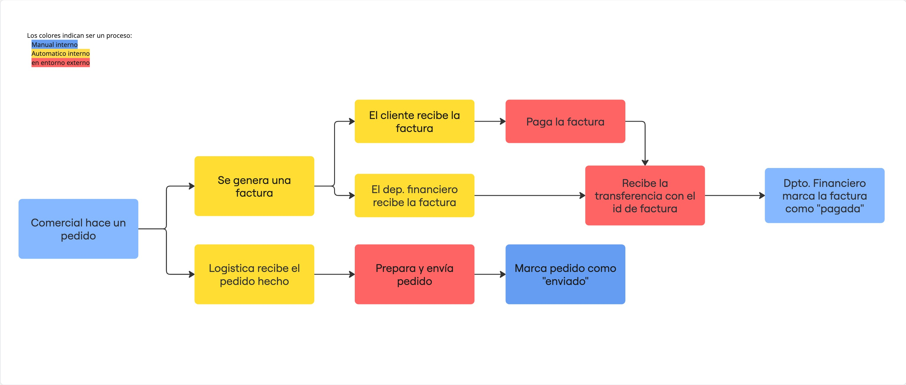

# Informe Técnico del Entorno de Ejecución

Esta documentación se ha desarrollado en Notion, habiendo sido descargada posteriormente para su documentación en formato markdown. Para verlo en el entorno Notion, puedes acceder a este link:
https://daffy-coconut-bce.notion.site/Informe-T-cnico-del-Entorno-de-Ejecuci-n-31ec082eb46b8078a97cdb0f18a81cb3

[Tipo de Sistema](Tipo%20de%20Sistema%2031ec082eb46b80f6988fd065ff082813.md)

[Requisitos Hardware y SO recomendado](Requisitos%20Hardware%20y%20SO%20recomendado%2031ec082eb46b80d695b0e42545e3304c.md)

[Instalación del entorno](Instalaci%C3%B3n%20del%20entorno%2031ec082eb46b80989a1ef75edb2d3e12.md)

[Usuarios, permisos y estructura de carpetas](Usuarios,%20permisos%20y%20estructura%20de%20carpetas%20354c082eb46b80a9b23ad0c19d54ad3e.md)

[Mantenimiento](Mantenimiento%2031fc082eb46b804782c2ea4a3c577a3c.md)

[Protección del sistema](Protecci%C3%B3n%20del%20sistema%2031fc082eb46b8001a23af169fcdfc36b.md)

El flujo de trabajo general de Logitron es:

