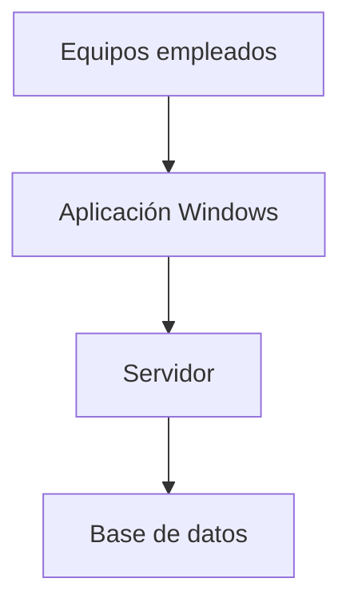

# Requisitos Hardware y SO recomendado

# Hardware

### Requisitos del servidor:

|  | **Requisitos mínimos** | **Requisitos recomendados** |
| --- | --- | --- |
| **CPU** | 2 núcleos (Intel i3 o equivalente) | 4 núcleos o más (Intel i5/i7 o equivalente) |
| **RAM** | 8GB | 16GB o más |
| **Almacenamiento** | 50GB | 200GB o más (backups) |
| **Red** | Conexión a la red local | Conexión a la red local + Acceso estable a internet |

Los requisitos podrán escalar en función del volumen de pedidos, número de usuarios y crecimiento de los datos.

### Requisitos de equipos cliente:

|  | **Requisitos mínimos** | **Requisitos recomendados** |
| --- | --- | --- |
| **CPU** | 2 núcleos | 4 núcleos |
| **RAM** | 4GB | 8GB o más |
| **Almacenamiento** | 1GB | 5GB o más |
| **Red** | Conexión a la red local | Conexión estable |

# Sistema operativo

El servidor central se ejecutará sobre un sistema operativo Linux, preferiblemente una distribución a servidores como Ubuntu Server o Debian.

Se elige Linux como sistema operativo porque:

- Presenta menor exposición a malware
- Permite un mejor control de servicios, usuarios y permisos del sistema
- Alta estabilidad, pudiendo funcionar largos periodos sin reinicios
- Menor consumo de recursos
- Alta compatibilidad con aplicaciones Java y servidores de aplicaciones

Los equipos cliente requieren un sistema operativo Windows. La aplicación se ejecutará como software instalado en el escritorio.

Diagrama de arquitectura:

